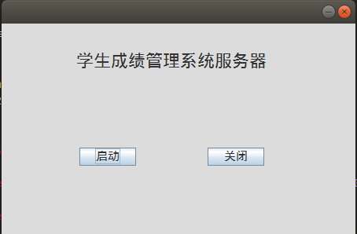
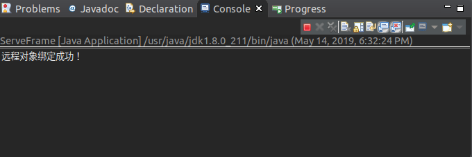
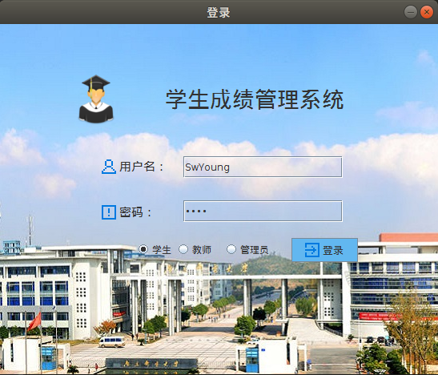
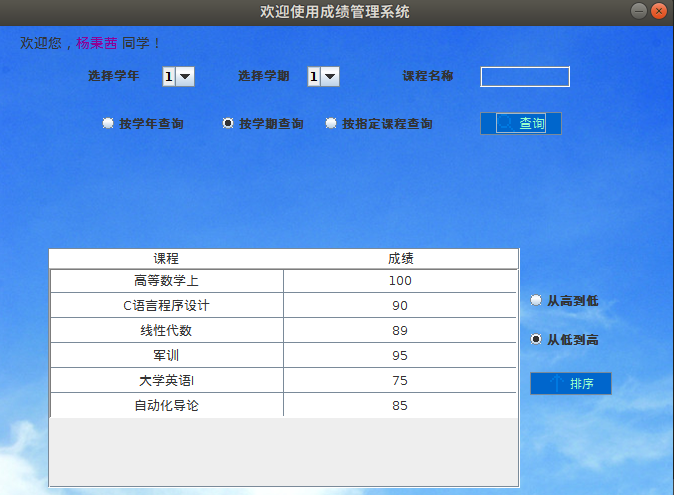

# Java课程设计：学生信息管理系统
说明：利用Java 编写界面，完成学生成绩的管理；
登录身份：
         学生：只对信息进行查询
         老师：对学生的信息进行增删改查，并进行简单的成绩分析
         管理员；管理学生、老师用户的增删改

操作演示：

​	服务器端：

点击启动

客户端：

输入账号，密码点击登录

登录成功，选择查询功能进行查询

By SwYoung
